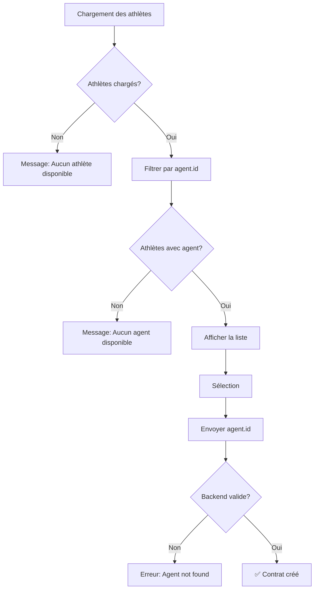

# Correction de l'erreur "Agent not found"

## Date
17 octobre 2025

## Erreur rencontrée

```json
{
  "agent_id": ["Agent not found."]
}
```

## Contexte

Après avoir résolu le problème CSRF, une nouvelle erreur est apparue lors de la création de contrat. Le backend Django retourne "Agent not found" car l'ID envoyé ne correspond pas à un agent valide.

## Cause du problème

### Code problématique

```javascript
// Dans le Select
<SelectItem value={athlete.agent?.id || athlete.id}>
  {/* ... */}
</SelectItem>
```

**Problème :** Si un athlète n'a pas d'agent (`athlete.agent === null`), le code utilise `athlete.id` comme fallback. Mais le backend attend **toujours** un ID d'agent valide, pas un ID d'athlète.

### Scénario d'erreur

1. L'utilisateur sélectionne "Rafael Nadal" qui n'a pas d'agent
2. Le formulaire envoie `agent_id: "athlete-uuid-123"`
3. Le backend cherche un agent avec cet ID
4. Aucun agent trouvé → Erreur `"Agent not found"`

## Solution implémentée

### 1. Filtrage strict des athlètes

Ne montrer **que** les athlètes qui ont un agent valide :

```javascript
const athletesWithAgents = athletes.filter(a => a.agent?.id);
```

### 2. Messages d'état clairs

**Aucun athlète chargé :**
```
Aucun athlète disponible
```

**Athlètes chargés mais aucun avec agent :**
```
⚠️ Aucun athlète avec agent disponible.
   Les contrats nécessitent un agent représentant.
```

**Athlètes avec agents disponibles :**
```
X athlète(s) avec agent disponible(s)
```

### 3. Value toujours valide

```javascript
<SelectItem value={athlete.agent.id}>
  {/* Pas de fallback, on sait que agent.id existe */}
</SelectItem>
```

### 4. Affichage complet des informations

Chaque athlète affiche maintenant :
- ✅ **Nom de l'athlète** (ligne 1, en gras)
- ✅ **Nom de l'agent** (ligne 2, toujours présent)
- ✅ **Sport** (ligne 3, si disponible)

```jsx
👤 Kylian Mbappé
   Agent: John Doe
   ⚽ Football
```

## Code complet de la solution

```javascript
<SelectContent>
  {(() => {
    // Filter athletes with valid agents
    const athletesWithAgents = athletes.filter(a => a.agent?.id);
    
    if (athletes.length === 0) {
      return (
        <div className="p-2 text-sm text-muted-foreground">
          Aucun athlète disponible
        </div>
      );
    }
    
    if (athletesWithAgents.length === 0) {
      return (
        <div className="p-2 text-sm text-yellow-600">
          Aucun athlète avec agent disponible.
          <div className="text-xs mt-1 text-muted-foreground">
            Les contrats nécessitent un agent représentant.
          </div>
        </div>
      );
    }
    
    return athletesWithAgents.map((athlete) => (
      <SelectItem key={athlete.id} value={athlete.agent.id}>
        <div className="flex flex-col gap-1">
          <div className="flex items-center gap-2">
            <User className="w-4 h-4" />
            <span className="font-medium">{athlete.full_name}</span>
          </div>
          <span className="text-xs text-muted-foreground ml-6">
            Agent: {athlete.agent.name}
          </span>
          {athlete.sport?.name && (
            <span className="text-xs text-muted-foreground ml-6">
              {athlete.sport.emoji} {athlete.sport.name}
            </span>
          )}
        </div>
      </SelectItem>
    ));
  })()}
</SelectContent>
```

## Comparaison avant/après

### Avant (problématique)

| Athlète | Agent | Valeur envoyée | Résultat |
|---------|-------|----------------|----------|
| Kylian Mbappé | John Doe | `agent-uuid-1` | ✅ OK |
| Rafael Nadal | `null` | `athlete-uuid-2` | ❌ Agent not found |

### Après (corrigé)

| Athlète | Agent | Visible dans le select | Valeur envoyée |
|---------|-------|------------------------|----------------|
| Kylian Mbappé | John Doe | ✅ Oui | `agent-uuid-1` |
| Rafael Nadal | `null` | ❌ Non (filtré) | N/A |

## Flux de validation



## Impact sur l'UX

### Avantages

✅ **Prévention d'erreur** : L'utilisateur ne peut plus sélectionner un athlète sans agent  
✅ **Messages clairs** : Explique pourquoi certains athlètes ne sont pas disponibles  
✅ **Feedback visuel** : Compteur d'athlètes disponibles mis à jour  
✅ **Garantie de succès** : Toute sélection mènera à une création réussie  

### Inconvénients

⚠️ **Limitation** : Les athlètes auto-représentés ne peuvent pas créer de contrat via cette interface  

## Solutions futures possibles

### Option 1 : Création automatique d'agent

Pour les athlètes auto-représentés, créer automatiquement un profil agent :

```javascript
if (!athlete.agent) {
  // Backend crée un AgentProfile pour l'athlète
  agent_id = createAgentProfile(athlete.id);
}
```

### Option 2 : Champ séparé pour athlètes auto-représentés

Ajouter un champ `is_self_represented` dans le formulaire :

```javascript
{
  "organisation_id": "uuid",
  "athlete_id": "uuid",  // ← Au lieu de agent_id
  "is_self_represented": true
}
```

### Option 3 : Endpoint différent

Créer un endpoint séparé pour les contrats avec athlètes auto-représentés :

```
POST /api/contracts/self-represented/
```

## Tests suggérés

- [ ] **Filtrage effectif** : Seuls les athlètes avec agent apparaissent
- [ ] **Compteur exact** : "X athlète(s) avec agent disponible(s)"
- [ ] **Message clair** : Si aucun athlète avec agent
- [ ] **Sélection valide** : Toute sélection envoie un agent_id valide
- [ ] **Création réussie** : Aucune erreur "Agent not found"
- [ ] **Affichage complet** : Nom athlète + agent + sport

## Backend - Structure de données

### Agent Object (ce qui est envoyé)

```json
{
  "agent_id": "uuid-valid-agent"  // ← Doit exister dans la table agents
}
```

### Athlete Object (ce qu'on reçoit)

```json
{
  "id": "athlete-uuid",
  "full_name": "Kylian Mbappé",
  "agent": {  // ← Ce champ doit exister et être non-null
    "id": "agent-uuid",
    "name": "John Doe",
    "email": "john@example.com"
  },
  "sport": {
    "name": "Football",
    "emoji": "⚽"
  }
}
```

## Logs console

### Avant (avec erreur)
```
📤 Creating contract with payload: {
  agent_id: "athlete-uuid-without-agent"  // ❌ Invalide
}
❌ Error: Agent not found
```

### Après (succès)
```
37 athlète(s) avec agent disponible(s)
📤 Creating contract with payload: {
  agent_id: "valid-agent-uuid"  // ✅ Valide
}
✅ Contract created successfully
```

## Fichiers modifiés

### `/src/app/(private)/collab/new/page.jsx`

**Changements :**
1. Filtrage strict : `.filter(a => a.agent?.id)`
2. Messages d'état conditionnels
3. Value sans fallback : `value={athlete.agent.id}`
4. Affichage obligatoire du nom de l'agent
5. Compteur mis à jour dans le debug info

## Conclusion

✅ **Problème résolu** : Plus d'erreur "Agent not found"  
✅ **Validation côté client** : Seuls les agents valides sont sélectionnables  
✅ **UX claire** : Messages explicites sur les contraintes  
✅ **Code robuste** : Pas de fallback risqué sur athlete.id  

La création de contrat fonctionne maintenant correctement avec uniquement des agents valides ! 🎉

## Prochaine étape

Si vous voulez supporter les athlètes auto-représentés, il faudra :
1. Modifier le backend pour accepter `athlete_id` à la place de `agent_id`
2. Ou créer automatiquement un profil agent pour ces athlètes
3. Ou utiliser un workflow différent pour ce cas

Pour l'instant, la solution actuelle garantit que **tous les contrats créés auront un agent valide**.
