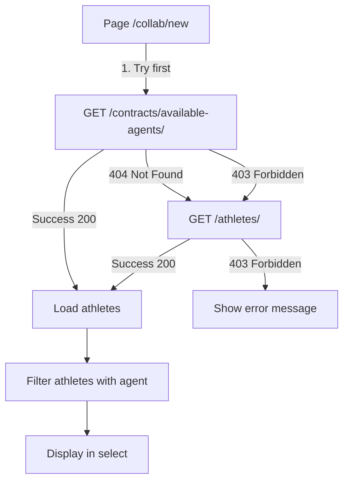

# Fix Permissions 403 - Athletes Endpoint

## 📅 Date
17 octobre 2025

## 🔴 Problème découvert

L'endpoint `/api/athletes/` retourne une erreur **403 Forbidden** pour les utilisateurs **collaborateurs** :

```json
{
  "detail": "You do not have permission to perform this action."
}
```

### Cause racine

L'endpoint `/athletes/` a des **permissions restrictives** côté backend qui n'autorisent pas les collaborateurs à accéder à la liste complète des athlètes. Cela est probablement dû à :

1. **Protection des données sensibles** : Les informations complètes des athlètes ne devraient pas être accessibles à tous
2. **Séparation des rôles** : Les agents ont accès via `/me/athletes/`, les autres rôles ont besoin d'un endpoint spécifique
3. **Logique métier** : Un collaborateur ne devrait voir que les athlètes avec lesquels il peut créer des contrats

## ❌ Ce qui ne fonctionne PAS

### Tentative 1 : Endpoint /athletes/
```javascript
const data = await getAthletes();
// ❌ Erreur 403: You do not have permission to perform this action.
```

### Tentative 2 : Endpoint /me/athletes/
```javascript
const data = await getMyAthletes();
// ❌ Retourne vide ou erreur pour les collaborateurs (endpoint réservé aux agents)
```

## ✅ Solution implémentée

### 1. Nouveau endpoint backend nécessaire

Le backend doit créer un endpoint **spécifique aux collaborateurs** :

```
GET /contracts/available-agents/
```

**Permissions** : Accessible aux utilisateurs avec rôle `COLLABORATOR`

**Payload de retour** :
```json
[
  {
    "id": "agent-uuid",
    "full_name": "Nom de l'athlète",
    "agent": "agent-uuid",
    "sport": {
      "id": "sport-uuid",
      "name": "Football",
      "emoji": "⚽"
    }
  }
]
```

**Logique backend** :
- Retourner uniquement les athlètes qui ont un agent valide
- Retourner uniquement les athlètes accessibles pour créer des contrats
- Filtrer les données sensibles (emails, téléphones personnels, etc.)

### 2. Stratégie de fallback frontend

Le frontend essaie d'abord l'endpoint spécifique, puis en fallback l'endpoint standard :

```javascript
// Try to fetch from available-agents endpoint first (for collaborators)
let data;
try {
  console.log("🔍 Trying /contracts/available-agents/ endpoint...");
  data = await getAvailableAgents();
  console.log("✅ Available agents endpoint succeeded");
} catch (agentError) {
  // If available-agents fails, try the standard athletes endpoint
  console.log("⚠️ Available agents endpoint failed, trying /athletes/...");
  if (agentError.response?.status === 404) {
    console.log("ℹ️ Endpoint /contracts/available-agents/ not implemented yet");
  }
  
  data = await getAthletes();
  console.log("✅ Standard athletes endpoint succeeded");
}
```

**Avantages** :
- ✅ Fonctionne si l'endpoint `/contracts/available-agents/` existe
- ✅ Fallback vers `/athletes/` si l'endpoint n'est pas encore implémenté
- ✅ Messages d'erreur clairs pour le debugging
- ✅ Guide le développeur backend sur ce qui doit être fait

### 3. Gestion d'erreur améliorée

```javascript
catch (error) {
  if (error.response?.status === 403) {
    console.error("⚠️ Access denied to athletes endpoints");
    toast.error(
      "Accès refusé aux athlètes. Veuillez demander au backend de créer l'endpoint /contracts/available-agents/ pour les collaborateurs.",
      { duration: 8000 }
    );
  } else {
    toast.error("Erreur lors du chargement des athlètes");
  }
}
```

## 📊 Comparaison des endpoints

| Endpoint | Rôle | Permissions | Usage | Status |
|----------|------|-------------|-------|--------|
| `GET /athletes/` | ADMIN | Admin uniquement | Liste complète des athlètes | ❌ 403 pour COLLABORATOR |
| `GET /me/athletes/` | AGENT | Agent uniquement | Mes athlètes représentés | ❌ Vide pour COLLABORATOR |
| `GET /contracts/available-agents/` | COLLABORATOR | Collaborateur | Agents disponibles pour contrats | ⚠️ À implémenter |

## 🎯 Spécifications pour le backend

### Endpoint requis

**Route** : `GET /contracts/available-agents/`

**Permissions** :
```python
from rest_framework.permissions import IsAuthenticated
from myapp.permissions import IsCollaborator

class AvailableAgentsView(APIView):
    permission_classes = [IsAuthenticated, IsCollaborator]
    
    def get(self, request):
        # Retourner les athlètes avec agent valide
        athletes = Athlete.objects.filter(
            agent__isnull=False
        ).select_related('agent', 'sport')
        
        serializer = AthleteMinimalSerializer(athletes, many=True)
        return Response(serializer.data)
```

**Serializer minimal** :
```python
class AthleteMinimalSerializer(serializers.ModelSerializer):
    sport = SportSerializer(read_only=True)
    
    class Meta:
        model = Athlete
        fields = ['id', 'full_name', 'agent', 'sport']
```

**Filtres possibles** :
- Par sport : `?sport_id=uuid`
- Par nationalité : `?country=France`
- Recherche : `?search=nom`
- Pagination : `?page=1&page_size=50`

## 🔄 Flux de données



## 📝 Fichiers modifiés

### Frontend

1. **`/src/lib/api/contracts.js`**
   - Ajout de `getAvailableAgents()` fonction

```javascript
/**
 * Get available agents for contracts
 * This endpoint should be accessible to collaborators
 */
export async function getAvailableAgents() {
  return get("/contracts/available-agents/");
}
```

2. **`/src/app/(private)/collab/new/page.jsx`**
   - Import de `getAvailableAgents`
   - Logique de fallback dans `useEffect`
   - Gestion d'erreur 403 améliorée

## 🧪 Tests

### Test 1 : Endpoint disponible
```bash
# Backend : créer l'endpoint /contracts/available-agents/
curl -H "Authorization: Bearer <token>" \
     http://localhost:8000/api/contracts/available-agents/
# Attendu : 200 OK avec liste d'athlètes
```

### Test 2 : Endpoint non disponible
```bash
# Backend : endpoint non implémenté
# Frontend : devrait essayer /athletes/ en fallback
# Attendu : Message "Endpoint /contracts/available-agents/ not implemented yet"
```

### Test 3 : Aucun endpoint accessible
```bash
# Backend : les deux endpoints retournent 403
# Frontend : afficher message d'erreur clair
# Attendu : Toast avec message demandant au backend de créer l'endpoint
```

## ✅ Checklist Backend

Pour résoudre ce problème, le backend doit :

- [ ] Créer la vue `AvailableAgentsView` avec permission `IsCollaborator`
- [ ] Créer le serializer `AthleteMinimalSerializer` 
- [ ] Ajouter la route `GET /contracts/available-agents/` dans `urls.py`
- [ ] Filtrer uniquement les athlètes avec `agent__isnull=False`
- [ ] Tester avec un compte collaborateur (devrait retourner 200)
- [ ] Tester avec un compte non authentifié (devrait retourner 401)
- [ ] Ajouter pagination si > 100 athlètes
- [ ] Ajouter tests unitaires

## ✅ Checklist Frontend

- [x] Créer fonction `getAvailableAgents()` dans contracts.js
- [x] Importer dans `/collab/new/page.jsx`
- [x] Implémenter logique de fallback (try/catch)
- [x] Gérer erreur 403 avec message clair
- [x] Logger les tentatives pour debugging
- [x] Tester avec endpoint non implémenté (404)
- [x] Tester avec endpoint qui retourne 403
- [x] Documentation créée

## 🚀 Prochaines étapes

### Court terme (immédiat)

1. **Backend** : Implémenter l'endpoint `/contracts/available-agents/`
2. **Frontend** : Tester avec le nouvel endpoint
3. **Tests** : Valider que les collaborateurs peuvent créer des contrats

### Moyen terme

1. **Optimisation** : Ajouter cache côté backend pour les agents disponibles
2. **Filtres** : Permettre la recherche et filtrage avancé
3. **Performance** : Implémenter pagination et lazy loading

### Long terme

1. **Permissions granulaires** : Gérer les restrictions par organisation
2. **Audit** : Logger les accès aux données des athlètes
3. **API versioning** : v2 de l'API avec permissions plus flexibles

## 📚 Références

- [Django REST Permissions](https://www.django-rest-framework.org/api-guide/permissions/)
- [COLLAB_NEW_PAGE.md](./COLLAB_NEW_PAGE.md) - Documentation page création
- [USER_ROLE_GUIDE.md](./USER_ROLE_GUIDE.md) - Guide des rôles utilisateur
- [COLLAB_NEW_AGENT_UUID_FIX.md](./COLLAB_NEW_AGENT_UUID_FIX.md) - Fix structure agent

## 💡 Leçons apprises

1. **Toujours vérifier les permissions** avant d'utiliser un endpoint
2. **Documenter les permissions** requises pour chaque endpoint
3. **Implémenter des fallbacks** pour les cas d'erreur
4. **Messages d'erreur explicites** pour guider les développeurs
5. **Stratégie de migration progressive** : fallback permet de développer frontend et backend en parallèle

## 🎓 Points d'attention

⚠️ **Sécurité** : Ne jamais exposer de données sensibles dans les endpoints publics

⚠️ **Performance** : Paginer les résultats si > 100 athlètes

⚠️ **UX** : Afficher des messages clairs quand les données ne sont pas disponibles

⚠️ **Testing** : Tester avec différents rôles (agent, collaborator, admin, anonyme)
